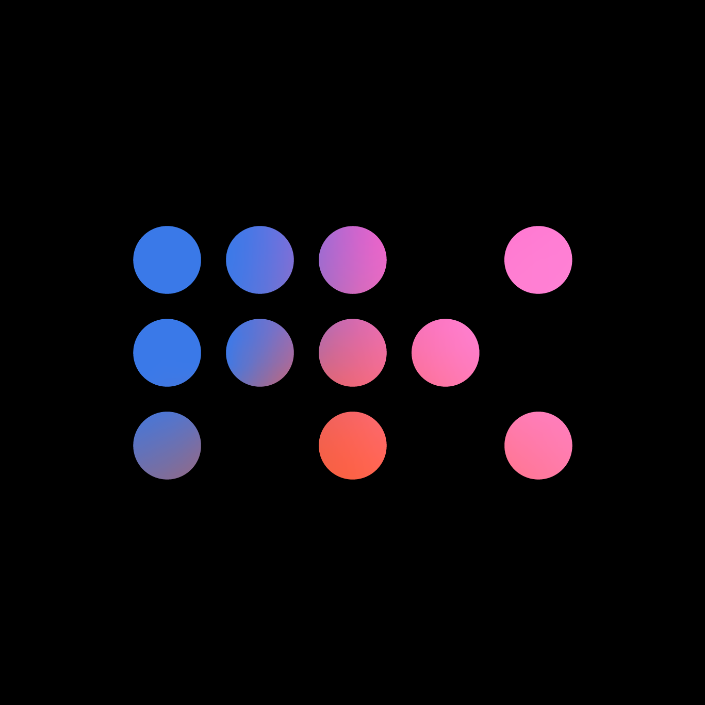
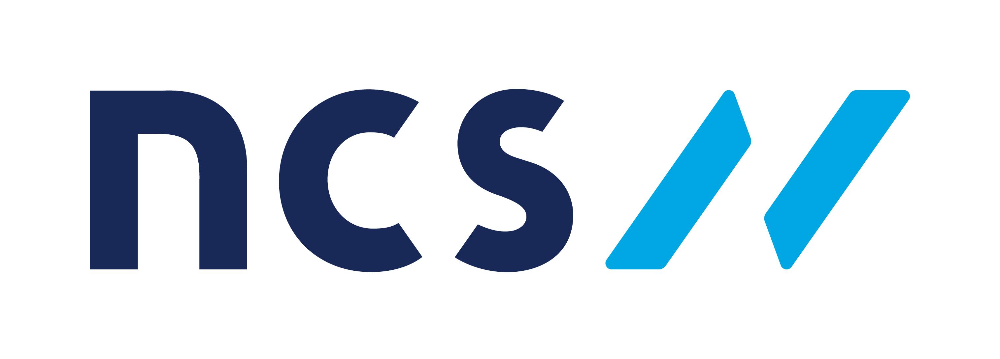
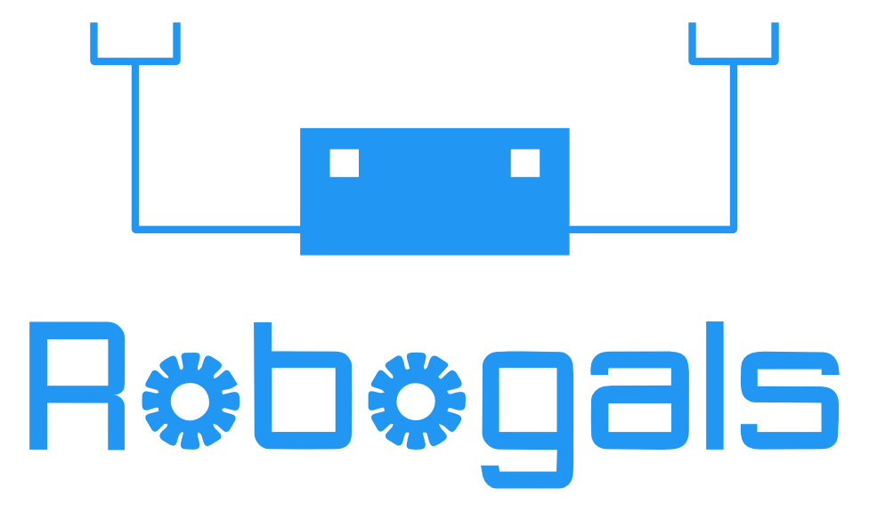

# Divjyot Singh

### Senior AI Engineer | Brisbane, Australia

*I taught machines to learn. Now I'm teaching them to think.*

---

<!-- ======================== SLIDE: AT A GLANCE ======================== -->

## The Story So Far

**6+ years** building intelligent systems across **5 companies**, **3 clouds**, and **2 continents**

<table width="100%">
<tr>
<td width="20%" align="center" valign="top">

 
**Westpac** 
Senior AI Engineer 
Dec 2025 – Present 
Australia's oldest bank & Big Four pillar — serving 13M+ customers since 1817

</td>
<td width="20%" align="center" valign="top">

 
**Bain & Company** 
Sr. ML Engineer 
Aug 2023 – Dec 2025 
Global top-3 strategy consultancy (MBB) advising the world's most ambitious companies

</td>
<td width="20%" align="center" valign="top">

 
**Max Kelsen** 
ML Consultant 
Sept 2022 – Aug 2023 
Brisbane-born AI powerhouse delivering deep-tech solutions for enterprise & healthcare

</td>
<td width="20%" align="center" valign="top">

 
**ARQ / NCS Group** 
ML Consultant 
Oct 2021 – Sept 2022 
APAC's leading technology services firm — a Singtel subsidiary with 13,000+ engineers

</td>
<td width="20%" align="center" valign="top">

 
**InspectRealEstate** 
ML & Ops Engineer 
Mar 2019 – Sept 2021 
Australia's leading proptech platform — AI-powered property inspections & tenant management

</td>
</tr>
</table>

---
 

<!-- ======================== SLIDE: WESTPAC ======================== -->

<table width="100%">
<tr>
<td align="center">

<b>&#x25CF; 2025</b>

## Westpac, Australia
### Senior AI Engineer
`Dec 2025 – Present`

Building the next generation of internal AI tooling at one of Australia's Big Four banks — 14M+ customers, $26B revenue.

**WUP Migration Project**
- Designing and delivering an AI Agentic workflow to automate legacy migration tasks
- Building multi-agent orchestration with tool-use, retrieval, and human-in-the-loop checkpoints
- Reducing manual effort across teams through intelligent document parsing and decision routing

</td>
</tr>
</table>

---
 

<!-- ======================== SLIDE: BAIN ======================== -->

<table width="100%">
<tr>
<td colspan="2" align="center">

<b>&#x25CF; 2023</b>

## Bain & Company, Australia
### Sr. Machine Learning Engineer | Advanced Analytics Group
`Aug 2023 – Dec 2025`

Led GenAI delivery across **5 major projects** spanning pharma, entertainment, construction, and healthcare.

### Highlights from 2+ years at Bain

</td>
</tr>
<tr>
<td width="50%" valign="top">

**GenAI Compliance QnA** — *Indian Construction Co*
> AI chatbot navigating labor laws across India's Central and State jurisdictions. Led end-to-end using LangChain, Azure AI Search, intent classification, and automated LLM evaluations. Deployed iterative retrieval with re-ranking to handle ambiguous multi-jurisdiction queries.

**GenAI Rules Engine** — *Australian Digital Imaging Co*
> AWS Bedrock Claude converting English policies into rule engine rules. Covered >50% of modality/region combinations, reducing call centre bottlenecks. Built validation framework to catch hallucinated rules before deployment.

**GenAI for Greenlighting IP** — *Movie Production House*
> Sentiment analysis + similarity search for greenlighting books, scripts, and games. Built modular DAG pipeline: scraping, analysis, vector search, LLM generation. Delivered insights across 1,000+ titles to inform investment decisions.

</td>
<td width="50%" valign="top">

**GenAI Email Generation** — *US Pharma Co*
> Automated marketing emails via RAG pipeline with hybrid vector search. Multi-step generation: raw content, persona follow-ups, instruction enforcement, styling. Achieved compliance with FDA/legal review constraints through guardrails and template enforcement.

**Synthetic Data Generation** — *US Pharma Co*
> Fine-tuned GPT-4 and LLaMA on custom patient datasets. Nested k-fold CV showed results comparable to traditional CTGAN models. Enabled downstream analytics without exposing real PHI data.

**Internal Tooling & Leadership**
> Built reusable GenAI accelerators adopted across Bain's AAG practice. Mentored junior engineers and led technical design reviews across multiple case teams.

</td>
</tr>
</table>

---
 

<!-- ======================== SLIDE: MAX KELSEN ======================== -->

<table width="100%">
<tr>
<td colspan="2" align="center">

<b>&#x25CF; 2022</b>

## Max Kelsen, Australia
### Machine Learning Consultant
`Sept 2022 – Aug 2023`

Architected production MLOps for banking and delivered ML-driven clinical research for healthcare.

</td>
</tr>
<tr>
<td width="50%" valign="top">

**MLOps for an Australian Bank** *(3 divisions)*
> Built Google Cloud MLOps from scratch — Vertex AI pipelines, data drift monitoring (Evidently), data quality checks (great-expectations), and SHAP explainability dashboards. Deployed GitHub Actions CI/CD across dev, staging, and prod. Served 3 business divisions with a single reusable platform, cutting model deployment time from weeks to hours.

</td>
<td width="50%" valign="top">

**Predicting Adverse Outcomes in Pregnancies**
> Answered 10+ clinical research questions with actionable ML insights for Queensland Health. Built reusable data pipelines across hospital datasets with nested cross-validation + hyperparameter tuning. Models identified high-risk patients earlier in care pathways, informing intervention strategies for clinicians.

</td>
</tr>
</table>

---
 

<!-- ======================== SLIDE: ARQ ======================== -->

<table width="100%">
<tr>
<td colspan="4" align="center">

<b>&#x25CF; 2021</b>

## ARQ / NCS Group, Australia
### Machine Learning Consultant
`Oct 2021 – Sept 2022`

Four diverse projects: fire prediction, logistics forecasting, public opinion analysis, and computer vision.

</td>
</tr>
<tr>
<td width="25%" align="center" valign="top">

**🔥 Fire Ignition**
 Random forest on Databricks predicting bushfire ignition risk from weather, terrain & vegetation data. Azure DevOps CI/CD with human-in-the-loop approval gates for model promotion.

</td>
<td width="25%" align="center" valign="top">

**📦 Logistics Forecast**
 AWS Forecast multivariate timeseries predicting parcel volumes across 50+ distribution centres. Accuracy improved many folds over prior heuristic solution — directly informing staffing decisions.

</td>
<td width="25%" align="center" valign="top">

**💬 Topic Modelling**
 HDBSCAN + UMAP clustering for public opinion analysis on government services. Net Promoter scoring deployed on SageMaker pipelines with automated retraining.

</td>
<td width="25%" align="center" valign="top">

**🕳️ Pothole Detection**
 PyTorch ResNet50 fine-tuned on truck-mounted camera feeds for road surface defects. Full AWS CDK infrastructure + SageMaker endpoint serving real-time predictions.

</td>
</tr>
</table>

---
 

<!-- ======================== SLIDE: IRE ======================== -->

<table width="100%">
<tr>
<td colspan="2" align="center">

<b>&#x25CF; 2019</b>

## InspectRealEstate (IRE), Australia
### Machine Learning & Ops Engineer
`Mar 2019 – Sept 2021`

Where production ML became real — building customer-facing AI products in real estate. First engineering hire for ML; grew the capability from zero to production.

</td>
</tr>
<tr>
<td width="50%" valign="top">

**Energy Bill Reader** — *Move Me In*
> Customers saved **AUD 400,000** in year one. OCR + bounding box analysis parsing energy bills at **>85% accuracy** across Origin, AGL, EnergyAustralia and more. Processed thousands of bills monthly, enabling automated energy plan comparisons at sign-up.

</td>
<td width="50%" valign="top">

**Tenant Scoring System**
> Two-phase extraction pipeline: custom object detection for ID documents (licences, Medicare cards, passports) + Microsoft OCR for field extraction. Auto-retraining via Azure Data Factory + Databricks with CI/CD promotion across environments. Reduced manual tenant screening from hours to seconds.

</td>
</tr>
</table>

---
 

<!-- ======================== SLIDE: SKILLS ======================== -->

## Tech Stack

*The tools I reach for*

<table width="100%">
<tr>
<td width="50%" valign="top">

### GenAI & AI Ops
- OpenAI, Claude, LLaMA — fine-tuning & prompt engineering
- RAG pipelines, vector stores, agentic workflows
- LLM evaluation (automated + human-in-loop)

### Data & Model Ops
- Vertex AI, SageMaker, Azure ML, Databricks
- Delta Lake, BigQuery, Snowflake, Elasticsearch
- Data drift (Evidently), quality (great-expectations)

</td>
<td width="50%" valign="top">

### ML & NLP
- NLP, LLMs, OCR, time series, tabular modelling
- Scikit-learn, PySpark, SpaCy, NLTK
- SHAP explainability, nested CV

### Dev & Infra
- Docker, Shell/Bash, Poetry/Conda
- CI/CD — GitHub Actions, Azure DevOps, CodeCommit
- AWS CDK, Terraform
- PowerBI, Tableau

</td>
</tr>
</table>

---
 

<!-- ======================== SLIDE: EDUCATION ======================== -->

## Education & Awards

<table width="100%">
<tr>
<td width="50%" align="center" valign="middle">

### 🎓 Master of Engineering Science
**Software Management** | GPA 5.81 
University of Queensland | 2018

</td>
<td width="50%" align="center" valign="middle">

### 🎓 Bachelor of CS & Engineering
**Honours** | CGPA 8.51 
Panjab University | 2016

</td>
</tr>
</table>

| Award | Where | Year |
|:---|:---|:---:|
| Scholarship — Winter Research Project | University of Queensland | 2017 |
| UQ Employability Grant — UQ Abroad | University of Queensland | 2018 |
| Scholarship — Short-Term Exchange | University of Tubingen, Germany | 2018 |

---
 

<!-- ======================== SLIDE: BEYOND WORK ======================== -->

## Beyond Work

*The chapters that shaped me*

<table width="100%">
<tr>
<td width="25%" align="center" valign="top">

### YSPN

**Young Sikh Professional Network** 
Organised speaker events, content creation, mentoring new members

</td>
<td width="25%" align="center" valign="top">

### Robogals

**150+ volunteer hours** 
Teaching kids to code with Lego Mindstorms. Road trips to rural Australia.

</td>
<td width="25%" align="center" valign="top">

### Research

**VR for Cerebral Palsy** 
Built a VR game for children's health using sponsored CaptoGlove data gloves. Collaborated with therapists, psychologists, and families across QLD universities.

</td>
<td width="25%" align="center" valign="top">

### Global

**University of Tubingen, Germany** 
International & European Studies exchange. Topped the German Language class.

</td>
</tr>
</table>

---

<!-- ======================== SLIDE: CLOSING ======================== -->

### Let's build something intelligent together.

